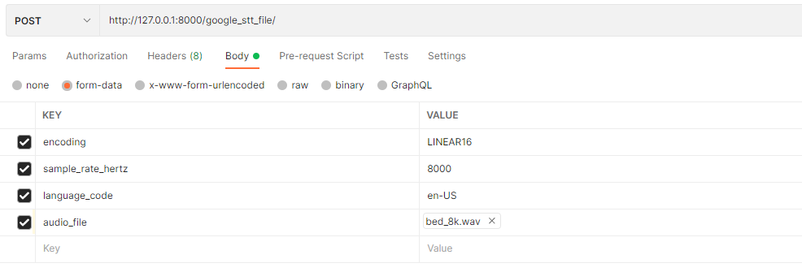

# google_stt with fastapi
You can use the google stt rest api via this project
1. only use google stt via rest api
2. use google stt with fastapi

## How to use

### 1. google_stt.py (stt rest api)
1. set your wav file (ex. bed_8k.wav)
```python
audio_file = open('bed_8k.wav', 'rb') # type your audio file source
```

2. type your google_stt api key
```python
google_stt.py

api_key = '' # type your google stt api key
api_url = 'https://speech.googleapis.com/v1/speech:recognize?alt=json&key=' + api_key
```

3. run python
```python
python google_stt.py
```

### 2. google_stt_file_upload.py (stt rest api with fastapi)

1. type your google_stt api key
```python
google_stt_file_upload.py

api_key = '' # type your google stt api key
api_url = 'https://speech.googleapis.com/v1/speech:recognize?alt=json&key=' + api_key
```

2. run fastapi server
```python
$ uvicorn google_stt_file_upload:google_stt_app --reload
```

3. use postman, curl or other way to check response


   
```
curl --location --request POST 'http://127.0.0.1:8000/google_stt_file/' \
--form 'encoding="LINEAR16"' \
--form 'sample_rate_hertz="8000"' \
--form 'language_code="en-US"' \
--form 'audio_file=@"{ROOT}/bed_8k.wav"'```
